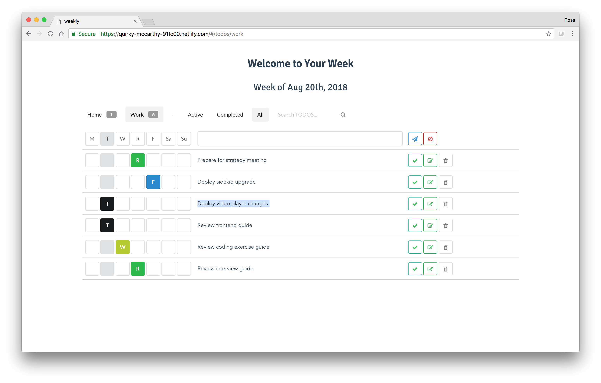

# weekly todos

A TODO list project in Vue.js inspired by the weekly TODO bullet journal from [@bluelahe](https://www.instagram.com/bluelahe)  described in [this BuzzFeed article](https://www.buzzfeed.com/rachelwmiller/this-running-weekly-to-do-list-setup-is-low-key-ge)

## Demo

The [demo site](https://quirky-mccarthy-91fc00.netlify.com/) contains the latest work-in-progress.

[](https://quirky-mccarthy-91fc00.netlify.com/)

## Project setup
```
yarn install
```

### Compiles and minifies for production
```
yarn run build
```

### Run your tests
```
yarn run test
```

### Lints and fixes files
```
yarn run lint
```

### Customize configuration
See [Configuration Reference](https://cli.vuejs.org/config/).
